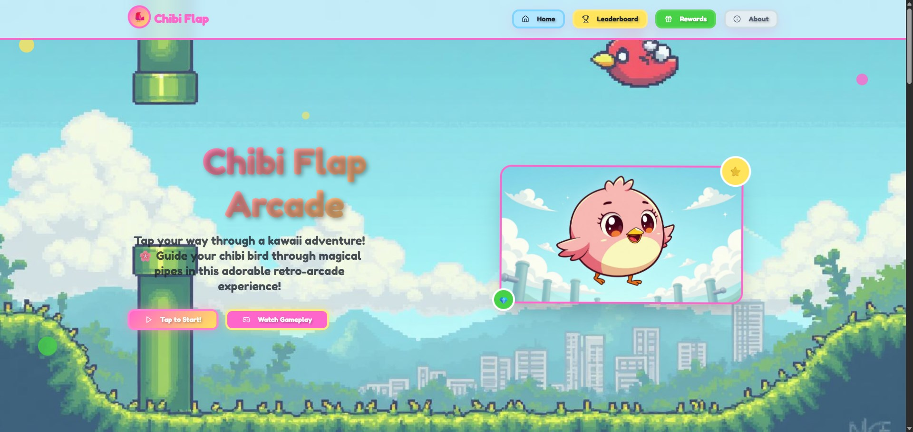

# 🐦 Chibi Flap Arcade — A Fresh Frontend Experience

A blazing-fast, modern frontend built with love using **Vite**, **React**, and **TypeScript**.  
Designed with **Tailwind CSS** + **shadcn/ui** for a clean, accessible, and beautiful UI out of the box.

---

## 🚀 Tech Stack

| Name           | Description                                       |
|----------------|---------------------------------------------------|
| 🧪 Vite         | Next-gen frontend tooling for lightning-fast dev |
| 💎 TypeScript   | Static typing for scalable, maintainable code     |
| ⚛️ React        | Declarative, component-based UI library           |
| 🧩 shadcn/ui     | Beautiful, accessible components built on Radix   |
| 🎨 Tailwind CSS | Utility-first CSS framework for rapid styling     |

---

## 📸 Preview

> 

---

## ✨ Features

- ⚡️ Super fast development & hot reload
- 🧱 Modular, reusable UI components
- 🎯 Type-safe logic & strict typing
- 🌗 Built-in dark mode support (optional)
- 📱 Mobile-friendly responsive design
- 🛠️ Easy to customize and extend

---

## 📂 Project Structure (simplified)

```

src/
├── components/     # Reusable UI components
├── pages/          # Page-level components
├── hooks/          # Custom hooks
├── lib/            # Utility functions or config
└── main.tsx        # Entry point

````

---

## 🧑‍💻 Getting Started

Clone the repo & install dependencies:

```bash
git clone https://github.com/lrmn7/Chibi-Flap-Arcade.git
cd Chibi-Flap-Arcade
pnpm install   # or yarn / npm
pnpm dev
````

---

## 📦 Build for Production

```bash
pnpm build
pnpm preview
```

---

## 📬 Contact

Have ideas or feedback? Let's connect!

* Twitter: [@LRMN](https://twitter.com/romanromannya)
* Project by [L RMN](https://github.com/lrmn7)

---